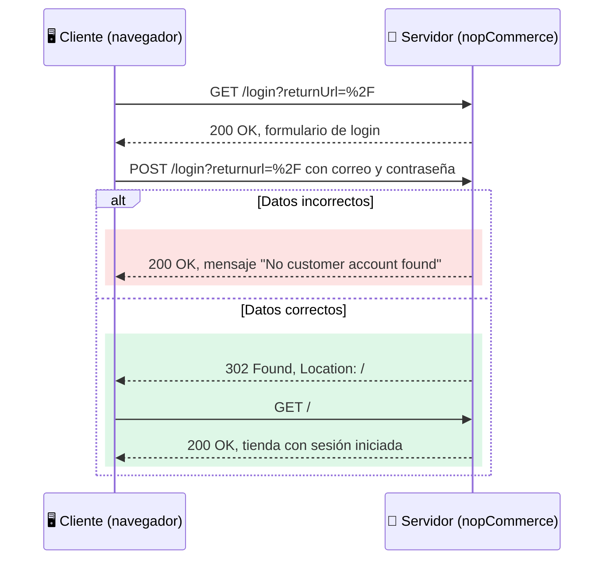

# Mapa de flujos críticos 

**Proyecto:** Tienda Virtual

**Autora:** María Elena Navarro Amaya (QA)

Este documento es la primera parte del documento de casos de prueba. Todas las peticiones fueron registradas por mí de nopcommerce del navegador (pestaña Network).

---

## 1. Diagrama cliente-servidor: Iniciar sesión

**Flujo crítico elegido:** iniciar sesión. Es crítico porque, si falla, el usuario no puede entrar a su cuenta ni cumplir el objetivo del sistema (comprar a su nombre y ver sus pedidos).





**Observación:** cuando el login es incorrecto, el servidor responde **200** y el error se muestra en el contenido de la página ("No customer account found"). Cuando es correcto, responde **302** y redirige a la página principal, donde ya aparecen MY ACCOUNT y LOG OUT.

---

## 2. Tabla de endpoints

| Flujo | Acción | Método | Endpoint | Código |
|---|---|---|---|---|
| Iniciar sesión | Ver el formulario | GET | /login?returnUrl=%2F | 200 |
| Iniciar sesión | Enviar datos inexistentes | POST | /login?returnurl=%2F | 200 |
| Iniciar sesión | Enviar datos válidos | POST | /login?returnurl=%2F | 302 |
| Registro | Ver el formulario | GET | /register?returnUrl=%2F | 200 |
| Cerrar sesión | Hacer clic en LOG OUT | GET | /logout | 302 |


---
**Leyenda:** 🔵 GET = consulta · 🔴 POST = envío de datos · 🟢 200 = respuesta correcta · 🟡 302 = redirección


## 3. Pseudocódigo

```
CLASE CasoDePrueba
    ATRIBUTOS
        id
        titulo
        flujo
        precondiciones
        pasos
        datos_de_prueba
        resultado_esperado
        resultado_obtenido
        estado
    FIN ATRIBUTOS
FIN CLASE

caso1 = NUEVO CasoDePrueba
    id                 = "CP-001"
    titulo             = "Login con cuenta inexistente"
    flujo              = "Iniciar sesión"
    precondiciones     = "Usuario sin sesión iniciada"
    pasos              = ["Abrir /login", "Escribir correo y contraseña", "Clic en LOG IN"]
    datos_de_prueba    = "prueba@correo.com / 123456"
    resultado_esperado = "Código 200 y mensaje 'No customer account found'"
    resultado_obtenido = "Código 200 y mensaje 'No customer account found'"
    estado             = "Pasó"
```

Los atributos de la clase serán los campos (columnas) de mi documento de casos de prueba.
